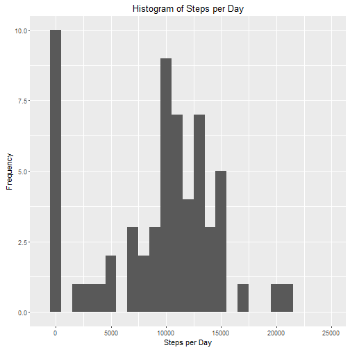
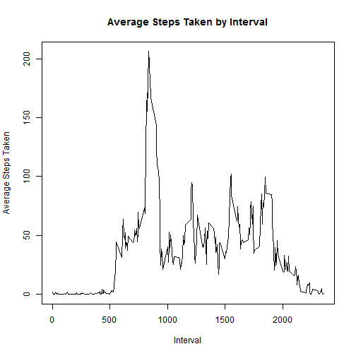
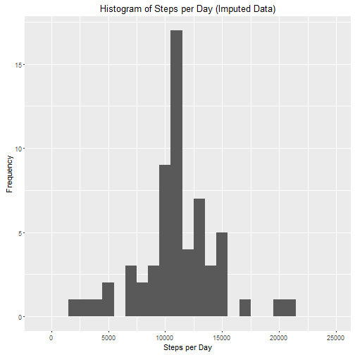
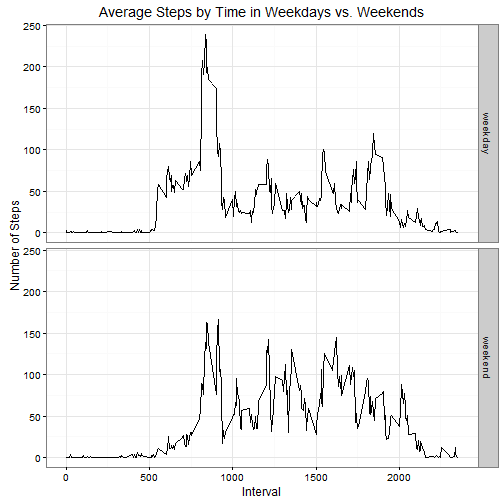

Coursera - Reproducible Research - Project 1
=========================================

This is the R markdown file for Reproducible Research - Project 1.

Load the necessary libraries.


```r
library(readr)
library(dplyr)
library(lubridate)
library(ggplot2)
```

##Read and Process the Data

This code reads in the raw data from the downloaded data file into an object named 'raw'.

It also processes the data by creating a data frame called 'dayTotals' which holds the total number of steps by day.

We also create an 'intervalAvg' data frame which holds the average number of steps taken across each interval. 


```r
raw <- read_csv("C:/Users/Scott Fry/Desktop/Coursera/Reproducible Research/Project 1/activity.csv")
```

```
## Parsed with column specification:
## cols(
##   steps = col_integer(),
##   date = col_date(format = ""),
##   interval = col_integer()
## )
```

```r
dayTotals <- group_by(raw, date) %>% summarize(dailySteps = sum(steps, na.rm=TRUE))
intervalAvg <- group_by(raw, interval) %>% summarize(avg = mean(steps, na.rm=TRUE))
```

##Total Steps per Day

Next, we create a histogram of the total number of steps taken per day, ignoring any missing values.


```r
ggplot(data = dayTotals, aes(dailySteps)) + geom_histogram(binwidth = 1000) + xlab("Steps per Day") + ylab("Frequency") + ggtitle("Histogram of Steps per Day") + xlim(-1000,25000)
```



This code calculates the mean and median of the total steps per day.


```r
meanStepsPerDay <- mean(dayTotals$dailySteps)
medianStepsPerDay <- median(dayTotals$dailySteps)
```

The mean steps per day is 9,354.

The median steps per day is 10,395.

##Average Steps per Interval

Here we create a time series plot of the average number of steps taken by interval.


```r
plot(intervalAvg$interval, intervalAvg$avg, type="l", xlab = "Interval", ylab = "Average Steps Taken", main = "Average Steps Taken by Interval")
```



This code calculates the interval with the highest average steps:


```r
highestAvg <- intervalAvg[which.max(intervalAvg$avg),"interval"]
```

The 5-minute interval with the highest average steps is 835.  This is the interval between 8:35 AM and 8:40 AM.

##Imputing Missing Values

There are a 8 days with missing values (NA) for every entry in the dataset, there are also two days that have only 2 intervals with recorded steps (2012-10-02 and 2012-11-15) which we will also consider missing for the purposes of imputing values.

For all 10 of the days we consider missing, the steps for each interval will be imputed with the mean number of steps for that interval in all non-missing days.  We will discard and impute the entries for the days where the data is not NA but rather shows only two intervals with steps.

This code calculates the number of missing values in the dataset (in this case rows with NA in the value for steps):


```r
numMissing <- sum(complete.cases(raw) == FALSE)
```

The total number of rows with missing values in the dataset is: 2304.

The code below imputes steps values for missing intervals with the mean for that interval in non-missing days.


```r
imputed <- raw
imputed[raw$date == ymd("2012-10-02") | raw$date == ymd("2012-11-15"),"steps"] <- NA

imputed[complete.cases(imputed) == FALSE,"steps"] <- intervalAvg[match(imputed[complete.cases(imputed) == FALSE,]$interval, intervalAvg$interval),"avg"]

dayTotalsImputed <- group_by(imputed, date) %>% summarize(dailySteps = sum(steps))
```

##Total Steps per Day (Imputed Data)

This code creates the same histogram of the total number of steps taken per day, but using imputed values for the missing data.


```r
ggplot(data = dayTotalsImputed, aes(dailySteps)) + geom_histogram(binwidth = 1000) + xlab("Steps per Day") + ylab("Frequency") + ggtitle("Histogram of Steps per Day (Imputed Data)") + xlim(-1000,25000)
```



This code calculates the mean and median of the total steps per day using the imputed values for the missing data.


```r
meanStepsPerDayImputed <- mean(dayTotalsImputed$dailySteps)
medianStepsPerDayImputed <- median(dayTotalsImputed$dailySteps)
```

The mean steps per day (with imputed data) is 11,116.

The median steps per day (with imputed data) is 10,766.

The mean and median steps per day using imputed data are higher than the original values which excluded the missing data. The mean increased because we counted the days with very few records as missing data, they were decreasing the average when they were included as valid data.  The median increased because all of the replaced mean values were higher than the previous median.

##Activity Patterns in Weekdays vs. Weekends

The following creates a new factor variable, 'dayType', which has the value of "weekend" or "weekday".  It also produces a panel plot showing the average steps taken in each time interval for weekdays vs. weekends.


```r
imputed$dayType <- ifelse(weekdays(imputed$date) %in% c("Monday", "Tuesday", "Wednesday", "Thursday", "Friday"), "weekday", "weekend")

intervalAvgDayType <- group_by(imputed, dayType, interval) %>% summarize(avg = mean(steps, na.rm=TRUE))

ggplot(data = intervalAvgDayType, aes(x = interval, y = avg)) + geom_line() + facet_grid(dayType ~ .) + xlab("Interval") + ylab("Number of Steps") + ggtitle("Average Steps by Time in Weekdays vs. Weekends") + theme_bw()
```


